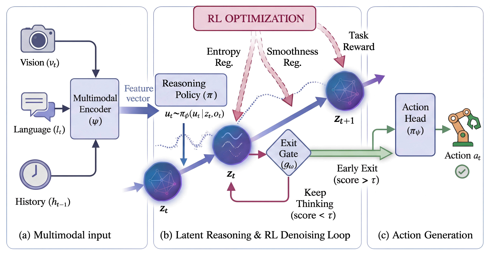

# 🤖 AVA-VLA: Think Less, Act Early

### ⚡ Reinforced Latent Reasoning with Early Exit in Vision-Language-Action Models

✨ **AVA-VLA** extends Vision-Language-Action models with latent reasoning, reinforcement-learning-based denoising, and adaptive early exit.

🎯 The goal is to reduce unnecessary reasoning steps while preserving robust robotic control behavior.



## 🔑 Highlights

- **Latent reasoning**: models intermediate reasoning as continuous latent state evolution instead of explicit text chain-of-thought generation.
- **RL-based denoising**: optimizes latent reasoning trajectories with task-level rewards and trajectory consistency terms.
- **Adaptive early exit**: stops latent reasoning when the exit gate estimates that the current state is sufficiently confident.
- **OpenVLA-compatible tooling**: keeps the OpenVLA/Prismatic training, fine-tuning, and robot evaluation structure used by this codebase.

## 📁 Repository Layout

```text
AVA-VLA/
├── prismatic/
│   └── models/vlas/avavla.py        # AVA-VLA model implementation
├── vla-scripts/
│   ├── finetune_avavla.py           # AVA-VLA fine-tuning entrypoint
│   ├── finetune.py                  # OpenVLA/OFT fine-tuning entrypoint
│   └── deploy_avavla.py             # AVA-VLA inference entrypoint
├── scripts/
│   ├── train_avavla_libero_10sample.py
│   ├── evaluate_avavla.py
│   ├── test_avavla.py
│   └── test_avavla_simple.py
├── experiments/robot/libero/        # LIBERO evaluation utilities
├── experiments/robot/aloha/         # ALOHA evaluation utilities
├── SETUP.md                         # Environment setup notes
├── LIBERO.md                        # LIBERO-specific instructions
├── ALOHA.md                         # ALOHA-specific instructions
└── AVA_VLA_README.md                # Additional AVA-VLA architecture notes
```

## 📦 Installation

Create a Python 3.10 environment and install the repository in editable mode:

```bash
conda create -n avavla python=3.10 -y
conda activate avavla

pip install torch==2.2.0 torchvision==0.17.0 torchaudio==2.2.0
pip install -e .
```

For training, install Flash Attention 2 after the editable install if your CUDA/PyTorch environment supports it:

```bash
pip install packaging ninja
ninja --version
pip install "flash-attn==2.5.5" --no-build-isolation
```

For LIBERO evaluation and rollout experiments, also install the LIBERO package and requirements:

```bash
git clone https://github.com/Lifelong-Robot-Learning/LIBERO.git
pip install -e LIBERO
pip install -r experiments/robot/libero/libero_requirements.txt
```

See [SETUP.md](SETUP.md), [LIBERO.md](LIBERO.md), and [ALOHA.md](ALOHA.md) for more setup details.

## 💾 Checkpoints and Data

This v1.0.0 code release does **not** publish AVA-VLA checkpoints. To use the code, train AVA-VLA from the provided scripts or start from public base models such as `openvla/openvla-7b` where appropriate.

Public data references used by the existing OpenVLA/LIBERO workflow:

- LIBERO RLDS datasets: `openvla/modified_libero_rlds`
- OpenVLA base model: `openvla/openvla-7b`
- LIBERO benchmark: https://github.com/Lifelong-Robot-Learning/LIBERO

Use local environment variables to keep paths machine-independent:

```bash
export DATA_ROOT=/path/to/datasets
export RUN_ROOT=/path/to/runs
export CHECKPOINT_DIR=/path/to/checkpoints
```

## ✅ Environment and Code Sanity Checks

These checks do not require released AVA-VLA checkpoints. They verify that the package, core modules, and command-line entrypoints are available after dependency installation.

Run the lightweight AVA-VLA tests:

```bash
python scripts/test_avavla_simple.py
python scripts/test_avavla.py
```

Check script imports and CLI parsing:

```bash
python vla-scripts/finetune_avavla.py --help
python scripts/evaluate_avavla.py --help
python experiments/robot/libero/run_libero_eval.py --help
```

## 🚀 Training

### AVA-VLA Fine-Tuning

Fine-tune AVA-VLA on an RLDS dataset:

```bash
python vla-scripts/finetune_avavla.py \
    --vla_path "$CHECKPOINT_DIR/prismatic-openvla-run" \
    --data_root_dir "$DATA_ROOT/modified_libero_rlds" \
    --dataset_name libero_spatial_no_noops \
    --run_root_dir "$RUN_ROOT/avavla" \
    --batch_size 1 \
    --max_steps 10000 \
    --history_window_size 2 \
    --reasoning_policy_type softmax \
    --ppo_clip_ratio 0.2 \
    --gae_lambda 0.95
```

Important AVA-VLA options include:

- `--history_window_size`: number of RLDS steps used to construct historical context.
- `--reasoning_policy_type`: latent reasoning policy type, commonly `softmax`.
- `--ppo_clip_ratio`: PPO clipping ratio for RL denoising updates.
- `--gae_lambda`: GAE lambda used in advantage estimation.
- `--run_root_dir`: output directory for logs and checkpoints.

### 10-Sample Smoke Test

For a small local sanity check, run the 10-sample LIBERO script with explicit dataset and output paths:

```bash
python scripts/train_avavla_libero_10sample.py \
    --tfrecord "$DATA_ROOT/modified_libero_rlds/libero_spatial_no_noops/1.0.0/libero_spatial-train.tfrecord-00000-of-00016" \
    --train-samples 10 \
    --eval-samples 10 \
    --bc-steps 10 \
    --latent-warmup-steps 5 \
    --ppo-steps 10 \
    --ppo-epochs 4 \
    --ppo-minibatch-size 4 \
    --exit-calibration-steps 5 \
    --exit-calibration-target-rate 0.5 \
    --batch-size 4 \
    --output-dir "$RUN_ROOT/avavla_libero_10sample"
```

The script writes logs, metrics, checkpoints, evaluation results, configuration, and a reusable `samples_10.json` file under the output directory.

### OpenVLA/OFT Baseline Fine-Tuning

The repository also retains the OpenVLA/OFT fine-tuning path inherited from the upstream codebase:

```bash
torchrun --standalone --nnodes 1 --nproc-per-node 1 vla-scripts/finetune.py \
    --vla_path openvla/openvla-7b \
    --data_root_dir "$DATA_ROOT/modified_libero_rlds" \
    --dataset_name libero_spatial_no_noops \
    --run_root_dir "$RUN_ROOT/openvla_oft" \
    --use_l1_regression True \
    --use_diffusion False \
    --use_film False \
    --num_images_in_input 2 \
    --use_proprio True \
    --batch_size 1 \
    --learning_rate 1e-4 \
    --max_steps 10 \
    --save_freq 10 \
    --save_latest_checkpoint_only True \
    --shuffle_buffer_size 1024 \
    --image_aug False \
    --lora_rank 32 \
    --merge_lora_during_training False
```

See [LIBERO.md](LIBERO.md) for full LIBERO training and evaluation notes.

## 📊 Evaluation

Offline JSON action-error and latency evaluation:

```bash
python scripts/evaluate_avavla.py \
    --benchmark json \
    --avavla-checkpoint "$CHECKPOINT_DIR/avavla" \
    --dataset "$DATA_ROOT/eval_dataset.json" \
    --unnorm-key libero_spatial_no_noops \
    --output "$RUN_ROOT/eval_results.json"
```

LIBERO rollout evaluation:

```bash
python scripts/evaluate_avavla.py \
    --benchmark libero \
    --avavla-checkpoint "$CHECKPOINT_DIR/avavla" \
    --task-suite libero_spatial \
    --num-trials-per-task 50
```

CALVIN and other external benchmarks require their own benchmark packages and evaluator scripts:

```bash
python scripts/evaluate_avavla.py \
    --benchmark calvin \
    --avavla-checkpoint "$CHECKPOINT_DIR/avavla" \
    --external-eval-script /path/to/calvin_eval.py \
    --task-suite abc_to_d
```

## 🤖 Deployment

Run local AVA-VLA inference with a trained checkpoint:

```bash
python vla-scripts/deploy_avavla.py \
    --checkpoint "$CHECKPOINT_DIR/avavla" \
    --image /path/to/image.jpg \
    --instruction "pick up the red block"
```

For robot-server deployment patterns, see [ALOHA.md](ALOHA.md).

## 📖 Citation

The paper has been accepted to ICML 2026. Use the following citation metadata for now:

```bibtex
@inproceedings{lei2026avavla,
  title = {Think Less, Act Early: Reinforced Latent Reasoning with Early Exit in Vision-Language-Action Models},
  author = {Lei, Dianqiao and Shan, Lianlei},
  booktitle = {International Conference on Machine Learning (ICML)},
  year = {2026}
}
```

See [CITATION.cff](CITATION.cff) for machine-readable citation metadata.

## 📄 License and Attribution

This repository is released under the MIT License. It includes AVA-VLA-specific contributions and code adapted from upstream OpenVLA-OFT/OpenVLA/Prismatic components. See [LICENSE](LICENSE), [NOTICE](NOTICE), and [ACKNOWLEDGEMENTS.md](ACKNOWLEDGEMENTS.md) for license and attribution details.
